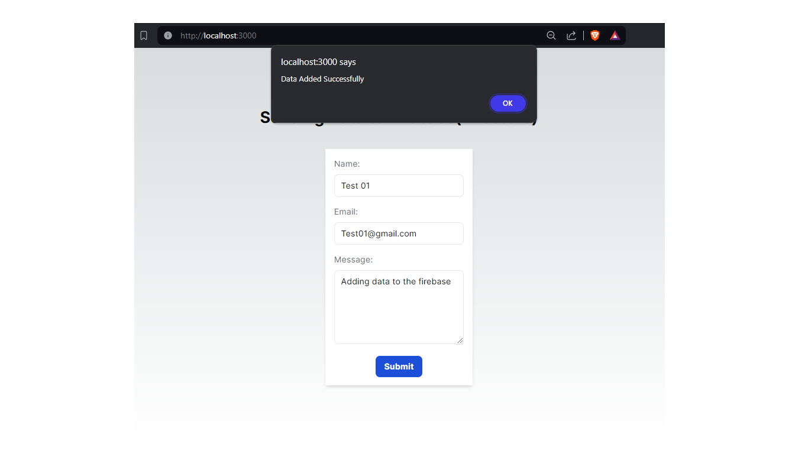

# Firebase Firestore Form Submission

This project is a simple React application that demonstrates how to submit data to Firebase Firestore using a form. The form captures a user's name, email, and message, and stores this information in a Firestore database.

- Next.js
- Tailwind CSS
- Firebase Firestore

# Screnshots

